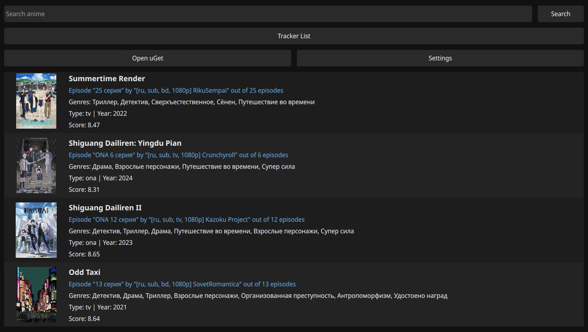

# Anime365 QtQuick

A QtQuick frontend for [Anime365](https://smotret-anime.org/) using Python as the backend.



## Install (NixOS / Nix)

### One-off

```sh
nix profile install github:fufsob/anime365-qtquick
nix run github:fufsob/anime365-qtquick
```

### home-manager (flakes) — recommended

Add the overlay to your nixpkgs, then use `pkgs.anime365` anywhere:

```nix
# flake.nix
inputs = {
  anime365.url = "github:fufsob/anime365-qtquick";
  anime365.inputs.nixpkgs.follows = "nixpkgs"; # avoids duplicate nixpkgs
};

outputs = { nixpkgs, home-manager, anime365, ... }: {
  homeConfigurations."youruser" = home-manager.lib.homeManagerConfiguration {
    pkgs = import nixpkgs {
      system = "x86_64-linux";
      overlays = [ anime365.overlays.default ];
    };
    modules = [ ./home.nix ];
  };
};
```

```nix
# home.nix
{ pkgs, ... }:
{
  home.packages = [ pkgs.anime365 ];
}
```

## Running from source

```sh
nix develop   # enter dev shell (sets up LD_LIBRARY_PATH, SSL certs, uv)
uv sync
./start.sh
```

## Building

### Desktop (Windows / Linux / macOS)

```sh
uv run --group build python build.py desktop
```

Output: `dist/Anime365/`

Single-file executable (slower startup):

```sh
uv run --group build python build.py desktop --onefile
```

Clean before building:

```sh
uv run --group build python build.py desktop --clean
```

### Android APK

Requires Android SDK, NDK, and pre-built Android aarch64 wheels for PySide6 and
shiboken6 (PyPI does not publish Android wheels — build from Qt sources or obtain
from Qt's CI).

```sh
export ANDROID_SDK_ROOT=$HOME/Android/Sdk
export ANDROID_NDK_ROOT=$ANDROID_SDK_ROOT/ndk/<version>

uv run --group android python build.py android \
    --wheel-pyside /path/to/PySide6-...-android_aarch64.whl \
    --wheel-shiboken /path/to/shiboken6-...-android_aarch64.whl
```

A `pysidedeploy.spec` config file will be created on first run; edit it if needed.

## Data locations

| Platform | Config | Database | Cache |
|----------|--------|----------|-------|
| Linux    | `~/.config/anime365/` | `~/.local/share/anime365/` | `~/.cache/anime365/` |
| Windows  | `%APPDATA%\anime365\` | `%APPDATA%\anime365\` | `%LOCALAPPDATA%\anime365\cache\` |
| macOS    | `~/Library/Preferences/anime365/` | `~/Library/Application Support/anime365/` | `~/Library/Caches/anime365/` |
| Android  | `/storage/emulated/0/Android/data/org.anime365.app/files/` | same | same |
